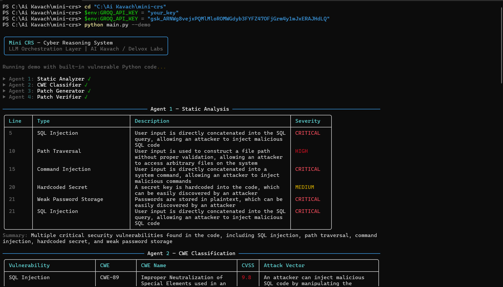
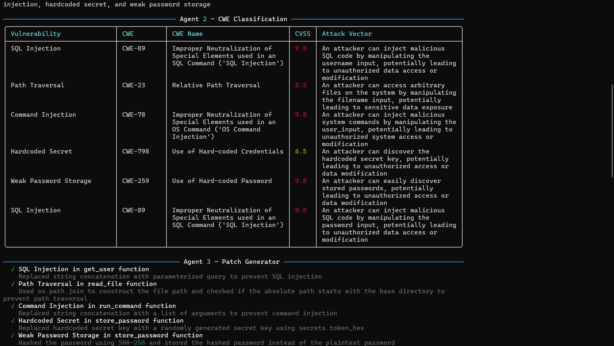
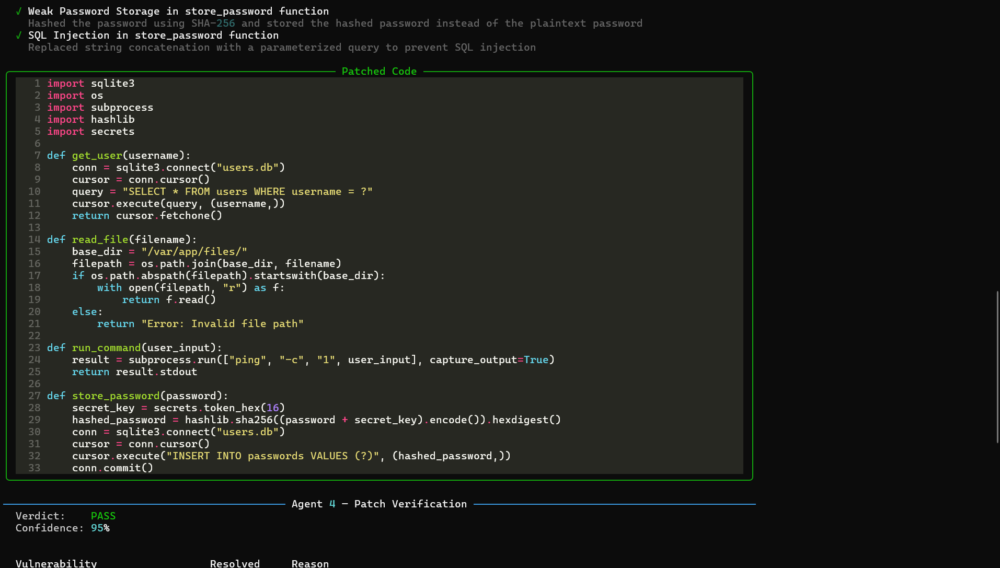
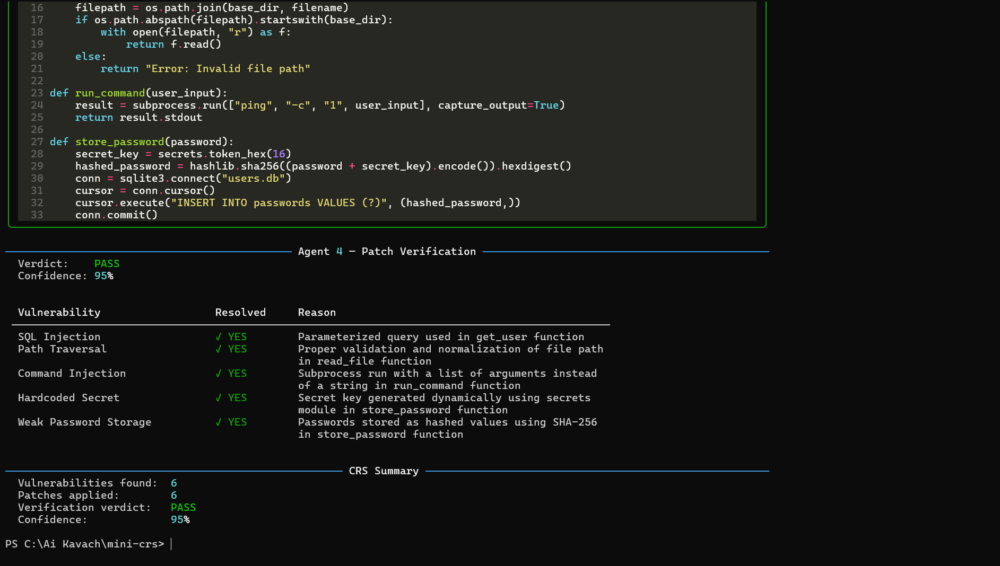

# Mini CRS — Cyber Reasoning System

**LLM Orchestration Layer for Automated Vulnerability Detection & Patching**

Built for [AI Kavach — Indian Army Terrier Cyber Quest 2026](https://cyberchallenge.in/tcq2026)






---

## What It Does

A 4-agent pipeline that mirrors the architecture of state-of-the-art Cyber Reasoning Systems:
Input: Vulnerable source code
↓
[Agent 1] Static Analyzer → finds vulnerability patterns
↓
[Agent 2] CWE Classifier → maps to CWE IDs + CVSS scores
↓
[Agent 3] Patch Generator → produces fixed, secure code
↓
[Agent 4] Patch Verifier → verifies fix resolves all issues
↓
Output: Full threat report + patched code + verification verdict


## Setup

```bash
git clone https://github.com/madhavvsharmma7/mini-crs
cd mini-crs
pip install -r requirements.txt
pip install groq
```

## Usage

```bash
# Set your free Groq API key (get one at console.groq.com)
export GROQ_API_KEY=your_key_here  # Mac/Linux
$env:GROQ_API_KEY = "your_key_here"  # Windows

# Run with built-in demo (6 vulnerabilities)
python main.py --demo

# Scan your own file
python main.py --file path/to/your/code.py

# Save JSON report
python main.py --demo --output report.json
```

## Agent Architecture

| Agent | Role | Output |
|-------|------|--------|
| Static Analyzer | Pattern-based vulnerability detection | Vuln list + severity |
| CWE Classifier | Maps vulns to CWE/CVSS framework | CWE IDs + CVSS scores |
| Patch Generator | Produces secure patched code | Fixed code + change log |
| Patch Verifier | Validates fix correctness | PASS/PARTIAL/FAIL + confidence |

## Tech Stack

- **Python 3.12+**
- **Groq API** (llama-3.3-70b-versatile) — LLM orchestration
- **Rich** — terminal UI
- **Typer** — CLI framework

## Vulnerabilities Detected

- SQL Injection (CWE-89)
- Path Traversal (CWE-22)
- Command Injection (CWE-78)
- Hardcoded Credentials (CWE-798)
- Insecure Password Storage (CWE-916)
- And more...

---

Built by [@madhavvsharmma](https://x.com/madhavvsharmma) · [Delvox Labs](https://delvoxlabs.com)